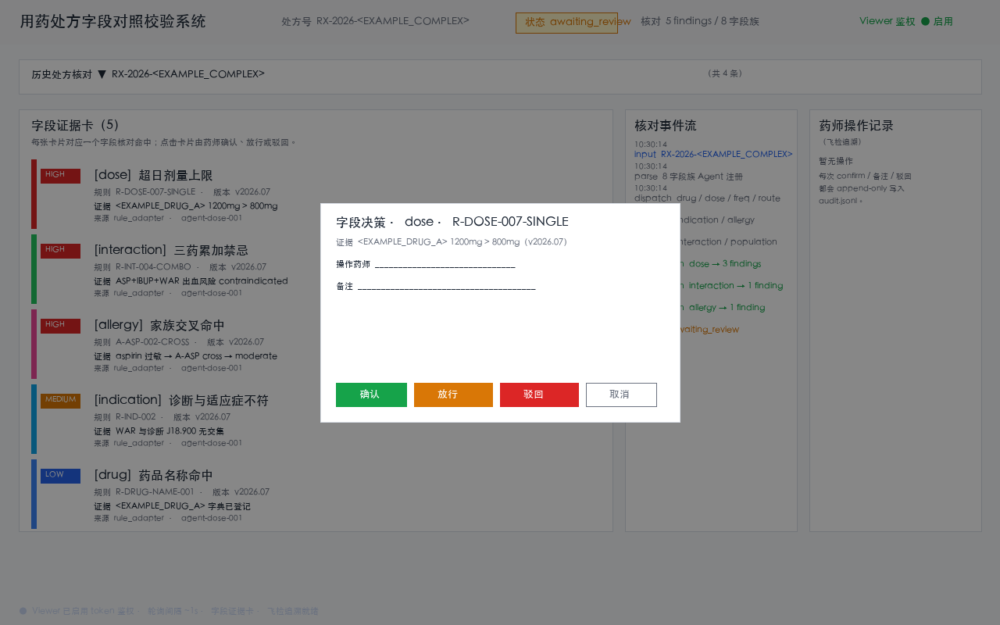

# Prescription Field Cross-Check System

> A clinical pharmacist drops in a prescription (or a batch). Eight field-family checker agents simultaneously traverse hospital rules, the drug dictionary, the interaction database, and the allergy database. The system outputs a "field × hit × evidence" cross-check grid, and after confirmation writes back to the HIS or the pre-audit work order.

This system breaks the traditional "pre-audit" workflow — which was a single sequential rule scan — into 8 field families (drug, dose, frequency, route, indication, allergy, interaction, population) that run in parallel. Every hit carries a rule ID, rule version, evidence text, and field value. Pharmacists confirm, annotate, or reject each one in the browser; every action is appended as an immutable entry to the audit log, then the system writes back to HIS / pre-audit. The rule library, drug dictionary, allergy database, and interaction database are all encapsulated behind formal integration interfaces; local stub implementations (prefixed `[FAKE]`) support desensitized sample demonstrations and unit tests.

## Applicable Scenarios / Target Roles

| Role | When to Use | What You Get |
|------|-------------|--------------|
| Clinical Pharmacist / Review Pharmacist | HIS pushes a new prescription, or pre-audit intercepts a high-risk prescription | A "field × hit × evidence" grid + evidence card + one-click confirm / annotate / reject |
| Pharmacy Department / Prescription Review Group | Monthly prescription sampling, special reviews, retrospective checks | Batch prescription checks in parallel, every prescription has an independent audit trail, exportable for medical records archiving |
| IT Department / Medical Insurance Auditor | Medical insurance surprise inspections, pharmacy-specific audits requiring rule version + per-item evidence playback | Every finding carries `rule_id` + `rule_version` + `evidence`, traceable back to the original rule and dictionary entry in the audit backend |
| Pre-Audit Operations / Rule Maintenance | Compare old vs. new rule versions after a rule package upgrade, regression testing | Run the same prescription with old and new `rule_version`, differences auto-aggregated into a ledger |
| Pharmacy Director / Medical Affairs Joint Sign-off | High-risk drugs / multi-drug combinations / special-population medications, requiring cross-perspective review | All 8 field families run; indication, interaction, and population families are jointly queried to avoid single-family oversights |

> **Table discipline**: this table only lists role language + business moment + verifiable deliverable. Rule IDs, HL7 fields, REST paths, state machine field names are placed under "Commands / API / Configuration".

## Key Capabilities

- A single prescription spawns **8 field-family checker agents** simultaneously, querying hospital rules / drug dictionary / interaction DB / allergy DB in parallel. Every hit carries rule ID, rule version, evidence text, and field value.
- Every finding renders as a **field evidence card**, auto-colored by field family (drug / dose / frequency / route / indication / allergy / interaction / population). High-severity hits have prominent color emphasis, and missing family in the rule library shows a yellow background pending manual review.
- Pharmacists **confirm / annotate / reject** item by item in the browser Viewer; actions are appended as immutable entries to the audit log. When writing back to HIS / pre-audit, the call carries the audit summary and the confirmation result.
- Rule packages, dictionary DBs, allergy DBs, and interaction DBs are all encapsulated behind **formal integration interfaces** (Protocol). Local stubs (Fake adapters) are prefixed `[FAKE]` for desensitized sample demonstrations. Real HIS / pre-audit calls automatically retry 3 times on timeout, with failures queued locally for re-running.
- Single prescription check → landing → Viewer readable completes end-to-end within 5 seconds; 5 prescriptions in batch complete within 15 seconds; token authentication prevents unauthorized LAN access to the local Viewer.
- The entire pipeline distinguishes **test stubs** (local implementations prefixed `[FAKE]`) from **formal integration specifications** (Protocol abstract interfaces), making it easy to swap adapter implementations on go-live without modifying the business main path.

## Quick Start

```bash
# 1. Install dependencies (Python 3.10+)
cd rx-field-check
python -m venv .venv && source .venv/bin/activate
pip install -e ".[dev]"

# 2. Prepare sample prescriptions
ls data/sample_rx/      # should see 4 desensitized samples: rx_basic / rx_overdose / rx_allergy / rx_complex

# 3. Run a check (CLI entry)
rxchk check data/sample_rx/rx_overdose.json
#   → spawns 8 field-family agents for parallel checking
#   → lands to runs/<rx_no>/{input.json, transcript.jsonl, findings.json, run.json}
#   → prints finding summary to terminal

# 4. Start Viewer (local HTTP + token authentication)
rxchk view <rx_no>
#   → terminal prints: Open: http://127.0.0.1:<port>/?token=<secret>
#   → open in browser to see the cross-check grid + field evidence cards + confirm modal

# 5. Verification: run desensitized sample e2e + one-click script
pytest tests/test_e2e.py -v
bash scripts/verify.sh    # one-click pass: 4 sample checks → background viewer → 9 curl assertions (runs list / findings / confirm / audit / token auth) → viewer auto-stops; exit 0 means all passed
```

## Commands / API / Configuration

| Entry | Command / Path | Description |
|-------|----------------|-------------|
| CLI real-time check | `rxchk check <rx_no_or_json_path>` | Parse prescription → spawn 8 field-family agents concurrently → land → print finding summary |
| CLI local view | `rxchk view <rx_no>` | Start stdlib HTTP Viewer + token authentication; terminal prints the tokened URL |
| HTTP submit | `POST /api/prescriptions/<rx_no>/check` | External systems (pre-audit / HIS interceptor) submit a prescription as JSON; asynchronously returns a check task ID |
| HTTP list | `GET /api/runs` | List `runs/` in mtime-descending order, each entry contains `prescription_no` + `status` (uploaded/parsing/running/awaiting_review/confirmed/overridden) |
| HTTP findings | `GET /api/run/<rx_no>/findings` | All findings for a single prescription (field family + field value + hit evidence + severity) |
| HTTP transcript | `GET /api/run/<rx_no>/transcript` | Per-event stream for a single prescription (agent dispatch / hit / error / completed), append-only |
| HTTP audit | `GET /api/run/<rx_no>/audit` | Pharmacist operation audit for a single prescription (confirm / override / reject / manual_override + operator + note + timestamp) |
| HTTP confirm | `POST /api/run/<rx_no>/confirm` | Pharmacist action on a single finding: `action` ∈ confirm / override / reject / manual_override; `operator` + `note` |
| HTTP writeback | `GET /api/run/<rx_no>/writeback` | View payload and status of writeback to HIS / pre-audit (pending / written back / failed) |
| File fallback | `./inbox/<rx_no>.json` | Drop a prescription JSON directly into the `inbox/` directory; the CLI directory-scan mode auto-dispatches (emergency entry when network is down / HIS unreachable); `rxchk check --from-inbox <dir>` triggers batch scan |
| One-click verification | `bash scripts/verify.sh` | Install deps → check 4 samples → start viewer in background (`--serve-seconds`) → 9 curl assertions (runs / findings / confirm / audit / token auth) → viewer auto-stops; exit 0 means all passed |

**Configuration file** (`rxchk.toml`, optional in project root):
- `[adapters]` section selects the real or stub implementation of HIS / pre-audit / rule library (`type = "fake" | "http"`)
- `[viewer]` section configures host (default 127.0.0.1), port (0 = random), token length (default 16)
- `[rules]` section declares the rule package version number; this version is transmitted to every finding and transcript at runtime

**Environment variables**:
- `RXCHK_RUNS_DIR`: `runs/` landing directory (default `./runs`)
- `RXCHK_INBOX_DIR`: `inbox/` fallback directory (default `./inbox`)
- `RXCHK_LOG_LEVEL`: log level (default `INFO`, can be set to `DEBUG` to see dispatch details)

The complete field schema (`Finding` / `Prescription` / `AuditEntry` / `HisWriteback`) is documented in the dataclass comments and `to_dict()` methods in `src/rxchk/models/`, `src/rxchk/audit.py`, `src/rxchk/adapters/his.py`. Error codes follow the Viewer HTTP response JSON `code` field (`unauthed` / `unknown_run` / `invalid_action` / `run_state_conflict`, etc.). Formal HIS / pre-audit integration is achieved by implementing `HisAdapterProtocol` / `PreauditAdapterProtocol` on the business side and swapping out the stub; the business layer remains unchanged.

## Typical Scenarios

**Scenario 1: High-Risk Prescription Review Triggered by Pre-Audit**

The pre-audit system intercepts an overdose prescription and pushes it to this system. The clinical pharmacist opens the Viewer and sees a yellow high-severity card hit in the "dose" field family: rule `R-DOSE-007` (drug `<EXAMPLE_DRUG_A>` daily dose upper limit 800mg), version `v2026.07`, with `evidence` pointing to the original dictionary entry. The pharmacist clicks confirm with the note "After communicating with the physician, the original dose is maintained with renal function monitoring". The audit log appends an `override + note` entry; the HIS prescription review note writeback completes, and a prompt pops up on the physician's workstation.

**Scenario 2: Monthly Prescription Sampling and Special Review**

The pharmacy department samples 50 antibiotic prescriptions monthly and batch-feeds them into this system. Eight field-family agents run in parallel; each prescription independently lands in `runs/<rx_no>/`. The pharmacist browses 50 finding grids at once in the Viewer list page, clusters views by field family (aggregating all "antibiotic + dose" hits), selects 8 high-risk prescriptions that need physician secondary signature, and exports the audit package to medical affairs for joint sign-off archiving.

**Scenario 3: Pharmacy Surprise Inspection Playback**

Medical insurance surprise inspectors review a particular prescription and demand to know "why this prescription was not intercepted by pre-audit". This system pulls the pharmacist's `confirm` + `note` at the time from `runs/<rx_no>/audit.jsonl`, reconstructs the dispatch order and hit basis (rule ID + version + evidence text) of the 8 field-family agents at that time from `transcript.jsonl`, plays back item by item, and cross-verifies with the rule package version — the entire chain does not depend on that day's HIS runtime log.

## Output Samples

**`runs/<rx_no>/findings.json` (desensitized excerpt)**:

```json
{
  "prescription_no": "<EXAMPLE_RX_NO>",
  "status": "awaiting_review",
  "items": [
    {
      "item_id": "item-001",
      "drug_code": "<EXAMPLE_DRUG_A>",
      "field": "dose",
      "field_value": "1200mg",
      "family": "dose",
      "rule_id": "R-DOSE-007",
      "rule_version": "v2026.07",
      "hit_explanation": "<EXAMPLE_DRUG_A> daily dose upper limit 800mg, this prescription 1200mg exceeds by 50%",
      "evidence": "drug_dict.yaml: <EXAMPLE_DRUG_A>.max_daily_dose = 800mg",
      "severity": "high",
      "source": "rule_adapter",
      "agent_id": "agent-dose-001",
      "created_at": "2026-08-20T10:30:15+08:00"
    }
  ]
}
```

**`runs/<rx_no>/audit.jsonl` (one line)**:

```json
{"ts": "2026-08-20T10:32:40+08:00", "rx_no": "<EXAMPLE_RX_NO>", "item_id": "item-001", "finding_id": "f-abc123", "action": "override", "operator": "<EXAMPLE_PHARMACIST>", "note": "After communicating with the physician, the original dose is maintained with renal function monitoring", "manual_override": true}
```

**`runs/<rx_no>/writeback.json` (HIS writeback payload)**:

```json
{
  "rx_no": "<EXAMPLE_RX_NO>",
  "audit_summary": {"confirmed": 0, "overridden": 1, "rejected": 0},
  "findings_count": 1,
  "writeback_status": "success",
  "writeback_at": "2026-08-20T10:33:02+08:00"
}
```

**Viewer Initial Page** (screenshot at [`docs/screenshots/viewer_initial.png`](docs/screenshots/viewer_initial.png)):



> Screenshot note: this environment has no GUI / browser dependency; the PNG is programmatically rendered by `scripts/make_screenshot.py` — it follows the real `src/rxchk/web/index.html` layout (top bar / historical prescription dropdown / field evidence card grid / check event stream / pharmacist operation log / decision modal / footer connection status) and applies field-family and severity colors from the real `style.css`. It serves as a product visual placeholder for README readers; the style tokens and runtime version follow `src/rxchk/web/style.css`.

## Architecture and Data Flow

```
┌─────────────┐    JSON    ┌────────────┐   dispatch    ┌─────────────────────────┐
│ HIS / Pre-  │ ─────────► │  Rx Parser │ ────────────► │  8 Field-Family         │
│ audit       │            │            │   in parallel │  Agent Pool             │
└─────────────┘            └────────────┘               │  drug / dose / freq /   │
       │                          │                     │  route / indication /   │
       │ file fallback            ▼                     │  allergy / interaction  │
       │                  ┌──────────────┐               │  / population           │
       ▼                  │ AgentCoord   │               └──────────┬──────────────┘
┌─────────────┐            │ state machine│                          │
│ ./inbox/    │            │ + concurrency│                          ▼
│ <rx>.json   │ ─────────► │ lock +       │               ┌──────────────────────┐
└─────────────┘            │ dispatcher   │ ──────────────►│ Rule / Dictionary /  │
                           └──────────────┘               │ Interaction / Allergy │
                                   │                       │ Adapters (Protocol)  │
                                   ▼                       │ Fake (desensitized)   │
                          ┌─────────────────┐              │ HTTP (formal)         │
                          │  Landing        │              └──────────┬──────────────┘
                          │  runs/<rx>/     │ ◄──────────────────────┘
                          │  {input,        │
                          │   transcript,   │              ┌─────────────────┐
                          │   findings,     │ ────────────►│ Viewer          │
                          │   run, audit}   │              │ stdlib HTTP     │
                          └────────┬────────┘              │ + token auth    │
                                   │                       │ + field evidence│
                                   ▼                       └────────┬────────┘
                          ┌─────────────────┐                       │
                          │  HIS / Pre-      │ ◄─────────────────────┘
                          │  Audit Writeback │   POST /confirm trigger
                          │  (Adapter)       │
                          └─────────────────┘
```

**Core data flow**: JSON prescription → Parser field validation → AgentCoordinator dispatches 8 field-family agents → each family agent calls its own family adapter → hit produces Finding → ReportWriter lands → Viewer renders field evidence cards → pharmacist confirms → Audit append → HIS adapter writeback.

**Field-family identification**: each agent only calls tools prefixed with its own family (an in-family prefix matching mechanism inspired by tool-renderer-style design; this project uses a dual-layer match of `family` enum and field-name pattern). Adding a new rule family requires no changes to the dispatch code, and is automatically picked up by the corresponding family agent.

## Security and Compliance Boundaries

- **Only document / field checks**: does not output diagnostic or treatment recommendations. All hits (findings) are purely objective statements of "rule ID + evidence + severity"; final confirm / reject is performed manually by the clinical pharmacist.
- **Rule version propagation**: every finding carries `rule_version`; cross-rule-version retrospective checks can be verified directly. Rule package upgrades must go through configuration switching and are not allowed to silently swap rules in production.
- **Audit append-only**: `audit.jsonl` and `transcript.jsonl` cannot be modified once written. When writing back to HIS / pre-audit, the call carries the audit summary and confirmation result; the writeback payload corresponds one-to-one with findings.
- **Local Viewer authentication**: the stdlib HTTP server only binds to 127.0.0.1, randomly generating a 16-character token at startup (URL `?token=<secret>`); missing or wrong token returns 401, preventing unauthorized LAN access.
- **Explicit separation of stubs and real implementations**: local stubs (Fake Adapter) have an explicit `[FAKE]` prefix in logs; formal integration interfaces are constrained by Protocol abstract signatures. HIS / pre-audit timeout (10s) → retry 3 times → enter the failed queue for re-running, no silent business-state rewrite.

## Project Structure

```
rx-field-check/
├── README.md
├── LICENSE                  # MIT
├── pyproject.toml
├── .gitignore
├── qrcode.jpg
├── src/
│   └── rxchk/
│       ├── models/          # Prescription / Finding / field family definitions
│       ├── parsers/         # Prescription JSON parsing + inbox scanning
│       ├── tools/           # Rule / Dictionary / Interaction / Allergy adapters
│       ├── agents/          # 8 field-family agent subclasses (drug / dose / freq / route / indication / allergy / interaction / population)
│       ├── coordinator.py   # AgentCoordinator dispatch coordinator
│       ├── report/          # Landing writer + state machine
│       ├── audit.py         # Append-only pharmacist operation audit
│       ├── adapters/        # HIS / pre-audit writeback adapters (Protocol + Fake stub)
│       ├── viewer/          # stdlib HTTP Viewer + authentication
│       ├── web/             # Frontend index.html + app.js + style.css
│       ├── check_engine.py  # Prescription check product-level main path
│       └── cli.py           # rxchk check / rxchk view entry
├── src/rxchk/data/
│   ├── drug_dict.yaml
│   ├── interaction_db.yaml
│   ├── allergy_db.yaml
│   ├── rule/
│   │   ├── dose_rules.yaml
│   │   └── population_rules.yaml
│   └── sample_rx/           # 4 desensitized samples: rx_basic / rx_overdose / rx_allergy / rx_complex
├── tests/                   # Unit tests + e2e (469 tests)
├── scripts/
│   ├── verify.sh            # One-click verification script (check × 4 → background viewer → 9 curl assertions → kill; exit 0 means all passed)
│   └── make_screenshot.py   # Programmatically generate Viewer screenshot (no browser dependency)
├── docs/
│   └── screenshots/
│       └── viewer_initial.png  # Viewer initial page layout placeholder (programmatically rendered)
├── inbox/                   # Prescription file fallback delivery directory (CLI directory-scan mode entry)
└── runs/                    # Check result landing directory (generated at runtime, gitignored)
```

## License

MIT

---

## Follow Us

Scan the QR code to follow our official account for updates and community access:

